# White Box Testing

## in API SERVER

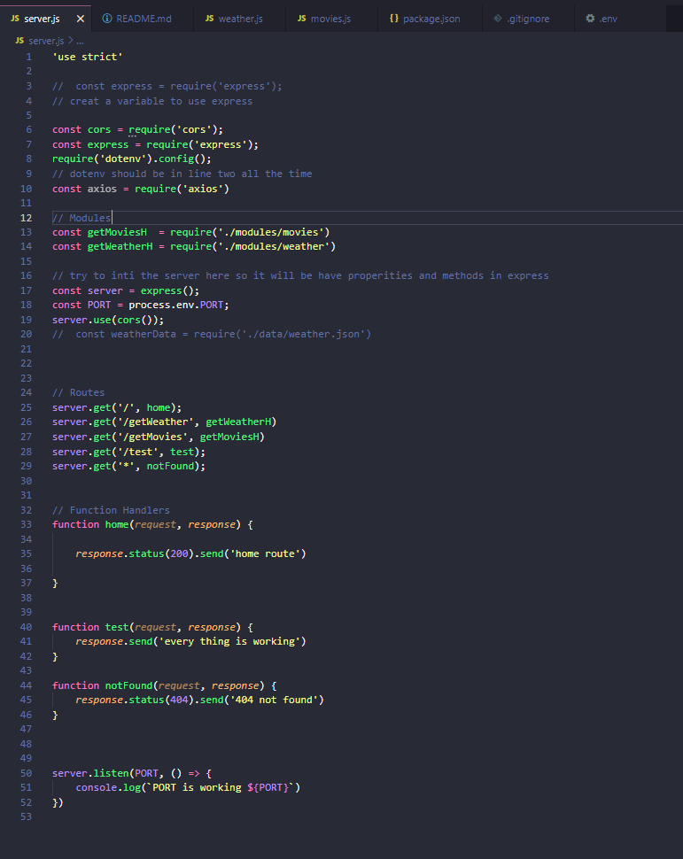

*in `server.js` to check if there is any problem in the server or the Routes we will get satus so if we at home the status 200 will be ok and if the Routs is not found or not exist it will give status 404 not found another thing that we cant but not found befor home or any other Routes or the only thing that will show will be 404 not found also if we didnt define Modules the Routes wont be able to work same to axios and express and so*

--------------------

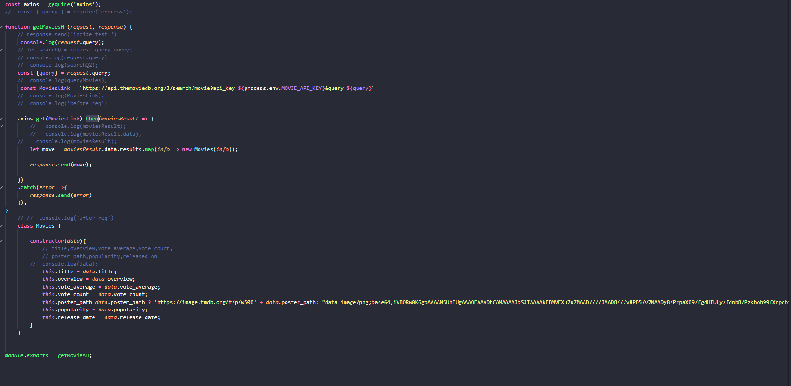

*in movies.js I did use .then and .catch so if `axios.get(MoviesLink).then(moviesResult =>` if the function was wrong or have any bugs the catch function will send error and if it was true the code will work and we will add new `Movies` another thing in the class line 40 if the Movie doesn't have image i will add this image withe image not found so the user will no that is image not exist*

--------------------

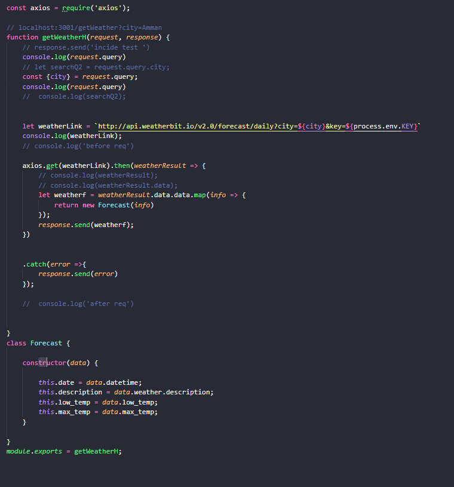

*in `weather.js` i did use the same .then and .catch so if there is any bugs or problem with the code the catch methode will send error*

--------------------

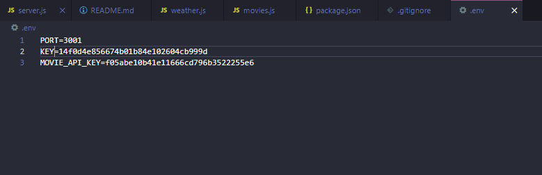
*here in `.env` we have to make sure that everything is a capital letter and there is no space so we don't have any problems*

--------------------

## In City Explorer APP

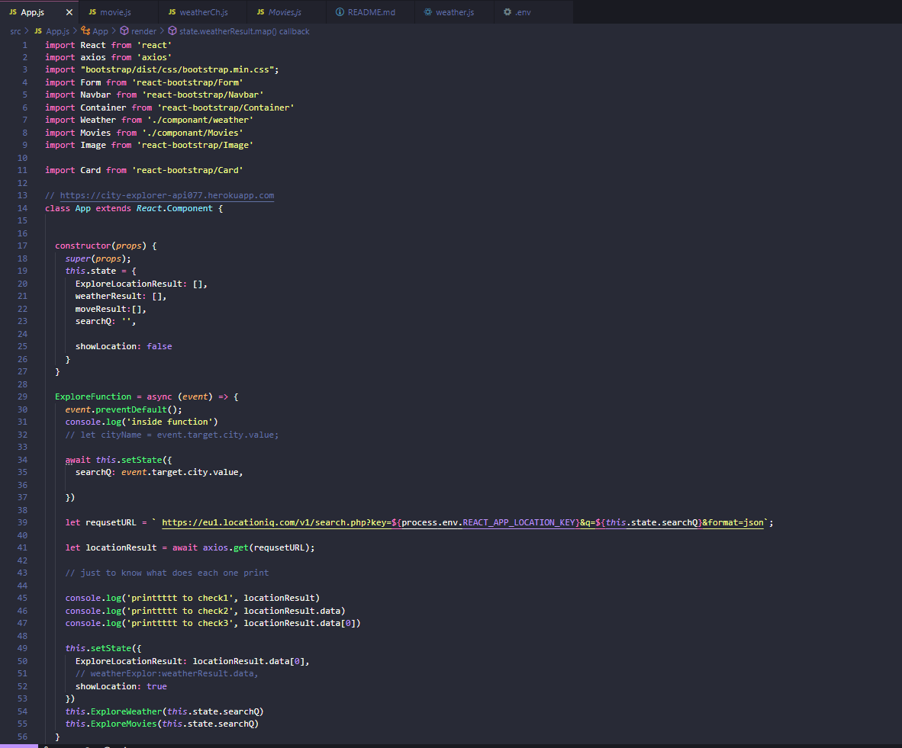
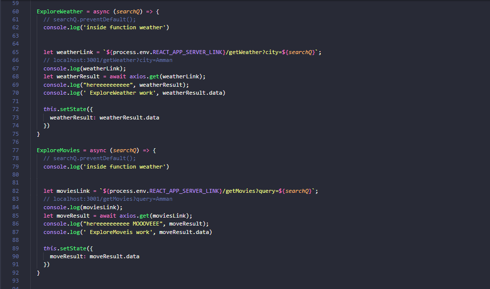
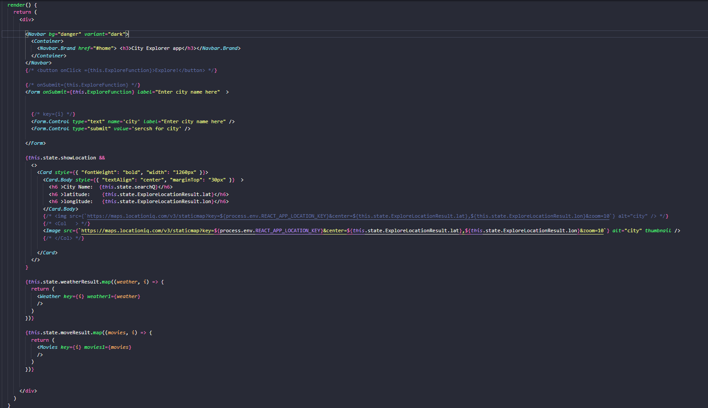

*in `APP.js` code I did test that if the function work or not by `console.log` to make sure that all the data are sending from the API server amd in the render i did return every thing from other componant so the code will look more clean and I did just call the class*

--------------------

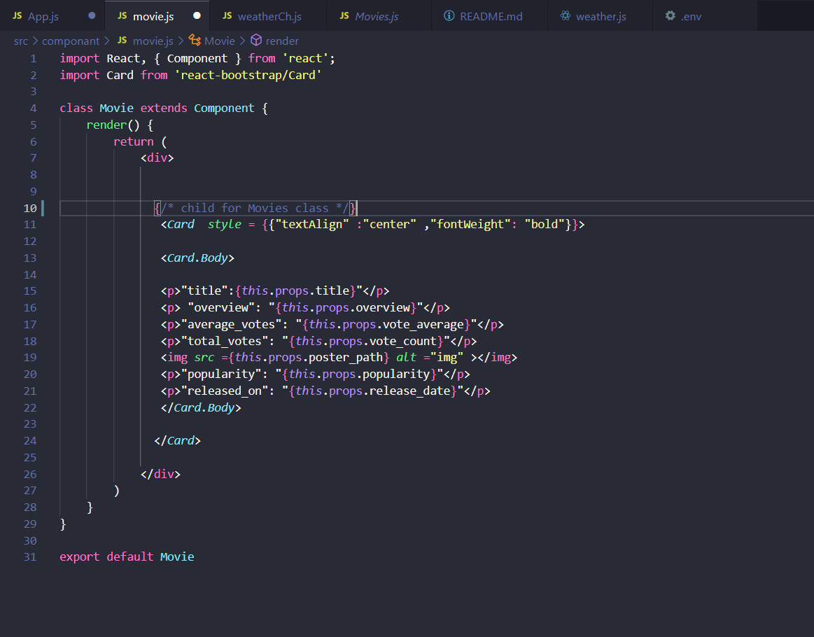
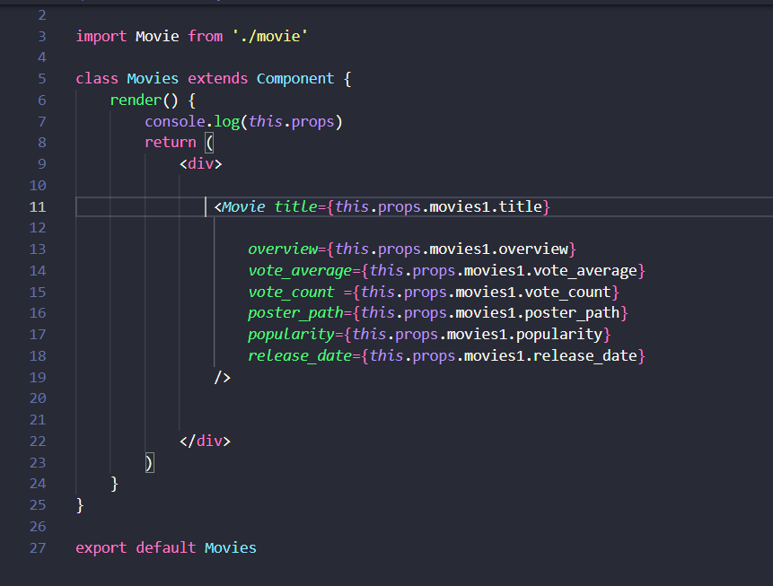
*here in movie i did add the card and the object from the class to call them and print them in aggod way then i did send this calss to his parent which is `Movies.js` to render it there and then send it to `APP.js`*

--------------------

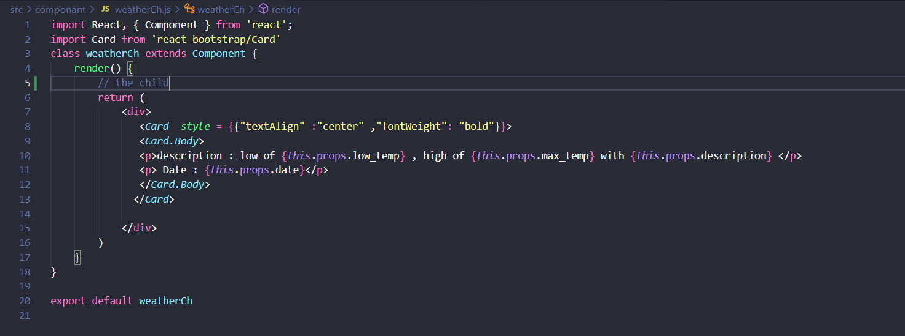
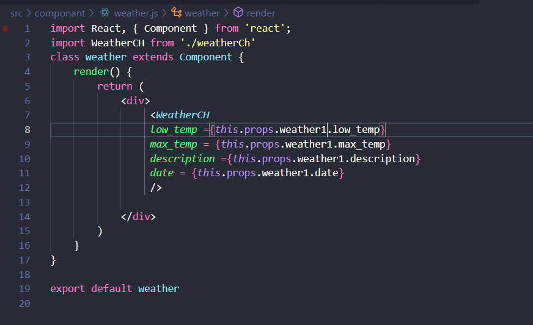
 *I did the same to weather just like movies so i did the print statment there and i call the object by using this.props then send them to there parents and call them by this.props.weather1.there name and they must be call in them in the right order or we will have an error and weather1 is the value that we did giv it to map in APP.js so we have to add it so we can call them with it*

 --------------------

 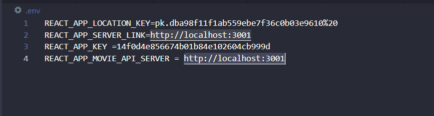
 *here also we have to write every thing in capetal letter and when we call them in APP.js we have to add before them `process.env.` or its not going to work and we will have an error another thing that this file we have to add it to ignore because we cant send it to github or any where so no one can have our key or url same to .env from API server*
